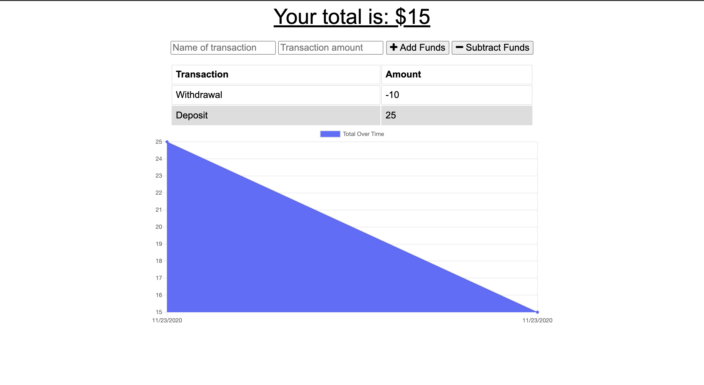

# pwaLearning

## Description
Using javascript, MongoDB, and Mongoose, I created a Progressive Web App which allows the user to track their budget.

## Table of Contents
* [Installation](#installation)
* [Usage](#usage)
* [Questions](#questions)

## Installation
Run npm install in the command line to get the required node modules.

## Usage
Run npm start in the command line.

## Deployed Application
https://lit-earth-27621.herokuapp.com/

## Questions
<a href="https://github.com/tmessall">Github</a>

Email me at tmessall17@gmail.com with any further questions.
